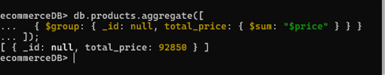

# **Documentación Mongo DB**
## Fase 1: MongoDB
 
## **Diseño de base de datos**
 
Diseño de la base de datos: Seleccionar un caso de uso donde sea apropiado utilizar una base de datos NoSQL como MongoDB (ej: almacenamiento de datos de redes sociales, catálogos de productos, logs de aplicaciones). Diseñar el esquema de la base de datos en MongoDB, definiendo las colecciones, documentos y campos.

Caso de Uso
Sistema de gestión de catálogos de productos para un e-commerce.
Un e-commerce necesita almacenar información sobre los productos de manera flexible, dado que los productos pueden tener diferentes atributos según su categoría (ropa, electrónicos, muebles, etc.). Además, se requiere soportar búsquedas rápidas y mantener un esquema escalable para futuros cambios.


## **Diseño del Esquema en MongoDB**
Colecciones principales:
## products
 Almacena los productos disponibles en el catálogo.
## categories
Define las categorías de los productos.
## users 
Almacena información básica de los usuarios.


## Colección: products

{
  "id": "ObjectId",
  "name": "string",
  "description": "string",
  "price": "decimal",
  "category_id": "ObjectId",
  "attributes": {
    "color": "string",
    "brand": "string",
    "battery_life": "number"
  },
  "images": ["string"],
  "stock": "number",
  "created_at": "ISODate",
  "updated_at": "ISODate"
}

id
-------
####  Tipo: ObjectId
####  Descripción: Un identificador único para el documento 

 name
 -----------
####  Tipo: string
#### Descripción: El nombre del producto o artículo.

description
----------------
####  Tipo: string
####  Descripción: Una descripción detallada del producto, incluyendo características, uso, o beneficios.

price
--------------
#### Tipo: decimal
#### Descripción: El precio del producto. Usualmente en formato numérico decimal para permitir valores con decimales.


category_id:
----------------
#### Tipo: ObjectId
#### Descripción: Un identificador único para la categoría a la que pertenece el producto. 

attributes
----------------
#### Tipo: Objeto
#### Descripción: Un objeto que contiene atributos adicionales del producto. Aquí se pueden incluir diversas características del producto que varían según el tipo de artículo, como el color, la marca y la duración de la batería. En este caso, incluye:

#### color
-----------
#### Tipo: string. 
El color del producto.
#### brand: Tipo: string. La marca del producto.
#### battery_life: Tipo: number. La duración de la batería del producto 

images
--------------
#### Tipo: array of strings
#### Descripción: Una lista de URLs o rutas de las imágenes del producto. Cada entrada es una cadena de texto que representa la ubicación de una imagen.

stock
-----------
#### Tipo: number
#### Descripción: La cantidad disponible en inventario del producto. Es el número de unidades que están disponibles para la venta.

created_at
-----------
#### Tipo: ISODate
#### Descripción: La fecha y hora en que el producto fue creado en el sistema. 

updated_at
-----------
#### Tipo: ISODate
#### Descripción: La fecha y hora de la última actualización del producto en el sistema. Similar a created_at, pero se actualiza cuando hay cambios en el producto

## Colección: categories
{
  "_id": "ObjectId",
  "name": "string",                  
  "attributes_schema": [             
    { "name": "string", "type": "string|number|boolean" }
  ],
  "created_at": "ISODate",
  "updated_at": "ISODate"
}


id
---------
#### Tipo: ObjectId
####  Descripción: Identificador único de la categoría. Generalmente generado automáticamente por la base de datos.

name
----------
####  Tipo: string
####  Descripción: Nombre de la categoría. Este campo es usado para identificar la categoría de manera legible para los usuarios.

attributes_schema
-------------------
####  Tipo: array de objetos
####  Descripción: Lista de atributos que pueden pertenecer a la categoría. Cada atributo es un objeto que contiene:

name:
-------------
#### Tipo: string
#### Descripción: Nombre del atributo ( "color", "tamaño").

Type
----------
#### Tipo: string
#### Descripción: Tipo de dato del atributo. Puede ser uno de los siguientes:
#### string: para texto.
#### number: para valores numéricos.
#### boolean: para valores lógicos (verdadero/falso).


created_at:
--------------
#### Tipo: ISODate
#### Descripción: Fecha y hora de creación de la categoría en formato ISO 

updated_at
---------------
#### Tipo: ISODate
#### Descripción: Fecha y hora de la última actualización de la categoría en formato ISO.

## Colección: users

{
  "_id": "ObjectId",
  "name": "string",
  "email": "string",
  "created_at": "ISODate",
  "updated_at": "ISODate"
}

id
--------
#### Tipo: ObjectId
#### Descripción: Identificador único del documento. Generalmente generado automáticamente por la base de datos para asegurar la unicidad.

name
------------
#### Tipo: string
#### Descripción: Nombre asociado al documento. Puede ser el nombre completo de una persona, entidad o cualquier otra referencia textual.

email
-----------
#### Tipo: string
#### Descripción: Dirección de correo electrónico asociada al documento. Es un valor único y generalmente se utiliza para la autenticación o el contacto.


created_at
----------------
####  Tipo: ISODate
#### Descripción: Fecha y hora en que se creó el documento. Representado en formato ISO 8601 (por ejemplo, "2024-12-14T12:00:00Z").

updated_at
--------------
#### Tipo: ISODate
#### Descripción: Fecha y hora en que se actualizó por última vez el documento. También representado en formato ISO 8601.

# Implementación en MongoDB
### 1.Consultas básicas
### Insertar Múltiples Documentos

## Implementación en MongoDB
### 1.Consultas básicas
#### Insertar Múltiples Documentos


#### Insertar registro

 

#### Seleccionar todos los productos 
db.products.find();


#### Seleccionar productos con precio mayor a 1000

db.products.find({ price: { $gt: 1000 } });


#### Seleccionar productos con stock menor a 10 y categoría específica
  


#### Actualizar Registro
#### Actualizar el precio de un producto específico


#### Actualizar el stock de los productos de una categoría

 


####  Eliminar un Registro
####  Eliminar un producto específico

 
 

### 2.Consultas con filtros y Operadores 
#### Obtener productos con precio entre 500 y 1000


#### Obtener productos de una marca específica y con tamaño "M"


### Uso de operadores lógicos
 	Obtener productos cuyo precio sea menor a 500 y stock mayor a 10


### Obtener solo el nombre y precio de todos los productos


## 3. Consultas de agregación para calcular estadísticas
 	
### Contar la cantidad total de productos

 

###  Sumar el precio total de todos los productos
 
 

###  Promediar el Precio de los productos
 
 

###  Obtener el total de stock por categoría
 

### Productos con stock promedio superior a 10

 
---

# **Documentación Hbase**

Inclusión Social y Reconciliación
Este dataset proporciona información sobre la juventud en un rango de edad de 14 a 26 años. Los datos recopilados ofrecen una visión general de las características demográficas, sociales y educativa de esta población.

| Nombre de la columna | Descripción                                                                 | Nombre del campo API | Tipo de Dato |
|----------------------|-----------------------------------------------------------------------------|----------------------|---------------|
| AÑO                  | Año en que se registró la información                                       | a_o                  | Número        |
| EDAD                 | Edad de la persona en el momento de la recopilación de la información      | edad                 | Número        |
| ZONA                 | Zona geográfica donde reside la persona en el momento de la recopilación    | zona                 | Texto         |
| GENERO               | Género con el que la persona se identifica                                   | genero               | Texto         |
| ETNIA                | Etnias descripción del grupo al cual pertenece                               | etnia                | Texto         |
| DISCAPACIDAD         | Tipo de discapacidad que tiene la persona                                    | discapacidad         | Texto         |
| ESCOLARIDAD          | Nivel de educación formal que ha completado la persona en el momento de la recopilación de los datos | escolaridad          | Texto  


Los datos utilizados se pueden consultar en el siguiente enlace:
JUVENTUD Dataset - Datos Abiertos Colombia


Iniciar el servidor de HBase

```bash 
start-hbase.sh
```

Iniciar el shell de HBase

```bash
hbase shell
```

Verificar el estado de HBase

```bash
status
```
 
Ejecutamos el servidor de `Thrift` para poder realizar consultas a través de `Python`
```bash
hbase-daemon.sh start thrift
```

Creamos los archivos tabla_juventud.py y hbase_consultas_tabla_juventud.py

```bash
nano tabla_juventud.py
```

```bash
nano hbase_consultas_tabla_juventud.py
``` 

---
Estructura de la Tabla en HBase

La tabla utilizada en HBase para este proyecto incluye las siguientes columnas:

Demografía: Información como edad, sexo, y ubicación.

Educación: Nivel educativo alcanzado y estado actual de educación.

Social: Participación en actividades comunitarias y condiciones sociales.

Operaciones Realizadas en HBase

Creación de la tabla: Se configuró una tabla con familias de columnas para almacenar los datos estructurados.

Inserción de datos: Los datos del dataset se cargaron en la tabla utilizando un script de Python.

Consultas: Se realizaron consultas para analizar tendencias y patrones en los datos.

Resultados Obtenidos

Identificación de patrones demográficos relevantes.

Análisis de la distribución educativa en el rango de edad.

Observaciones sobre la participación social de la juventud.

### **Evidencias** 


